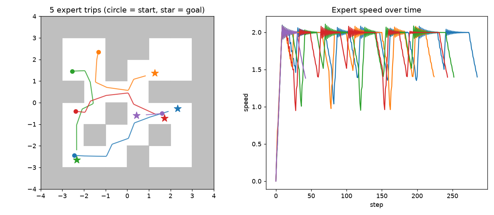

# Impact of Demonstration Error Types on Imitation Learning (PointMaze)

CS59300-ILR course project. Question: which kinds of mistakes in demonstration data hurt a
behavior-cloning navigation policy the most, and do combinations of mistakes hurt more than the sum of the parts?

## Status: Bricks 1 and 2 are done, Brick 3 in progress

| Brick | What | File | Done |
| --- | --- | --- | --- |
| 1 | Environment installs and runs | `src/check_env.py` | yes |
| 1-2 | Clean expert demonstrations (500 trips) | `src/make_expert_data.py` | yes |
| 2 | Look at the data | `src/plot_trajectories.py` | yes |
| 3 | Train clean BC baseline | `src/train_bc.py` | in progress |
| 4 | Evaluation harness (4 metrics, seeds) | `src/evaluate.py` | |
| 5-6 | Six mistake makers | `src/corrupt.py` | |
| 7 | Combinations | | |
| 8 | Diagnostic classifier (bonus) | | |

## Setup (Windows, macOS or Linux)

Run everything from the repository root.

```bash
python -m venv .venv
.venv\Scripts\activate          # Windows.  On macOS/Linux: source .venv/bin/activate
pip install -r requirements.txt
python src/check_env.py         # last line must say ALL GOOD
python src/make_expert_data.py --episodes 500
python src/plot_trajectories.py # writes figures/expert_trajectories.png
```

## Repository layout

```
src/        all code; src/common.py defines the environment and the expert
data/       generated datasets (.npz, .csv), not committed
figures/    plots
results/    evaluation CSVs, not committed
```

## The world



- Environment: `PointMaze_Medium-v3` (Gymnasium-Robotics). A ball with momentum in an 8x8 maze.
- State: `[x, y, vx, vy]` plus the goal `[goal_x, goal_y]` (6 numbers for the policy).
- Action: `[fx, fy]`, a push in [-1, 1].
- Expert: BFS path over maze cells + a speed-capped PD controller (`src/common.py`). 100% success.
- Why Medium and not UMaze: in UMaze a clean BC policy already scores 100%, so there is no room to
  measure damage. In Medium, clean BC scores about 94-98% in testing (120 epochs, seeds 0-2), which
  leaves room for mistakes to show.

## Experiment plan

- **Mistake types:** wrong left turn, wrong right turn, delayed turn, speed error, obstacle-avoidance
  mistake, missing recovery. Each is a flawed version of the expert that re-records trips.
- **Datasets:** clean, 6 single-mistake sets (20% of trips corrupted), 3 pairs, 1 mix of all = 11 datasets.
- **Runs:** 11 datasets x 5 seeds = 55 BC policies.
- **Metrics:** success rate, collision rate, path efficiency, time to goal. Every policy is tested on the
  same fixed set of start/goal pairs (`TEST_SEED = 12345`).

## Design decisions worth knowing

- **BC is written in plain PyTorch, not with the `imitation` library.** `imitation` 1.0.1 pins
  `gymnasium==0.29.1`, which conflicts with the current PointMaze (`gymnasium>=1.2`). Behavior cloning is
  supervised regression (state in, action out), about 30 lines, so nothing is lost.
  Network: MLP 6-128-128-2, MSE loss, Adam (lr 1e-3), batch 256, 120 epochs.
- **120 epochs, not 40.** At 40 epochs clean BC scored 81-93% across seeds; at 120 it scored 94-98%.
  A weak baseline would blur the damage caused by each mistake type.
- **Expert data is generated locally, not downloaded from Minari.** This makes the project self-contained and
  lets the mistake makers see the maze walls. The Minari PointMaze datasets are a fine alternative.
- **Collisions** are counted as MuJoCo contacts between the ball (`particle_geom`) and any wall geom (`block_*`).
- The CSV (`data/expert_clean.csv`) has one row per step so you can explore it with SQL, pandas or DuckDB.
